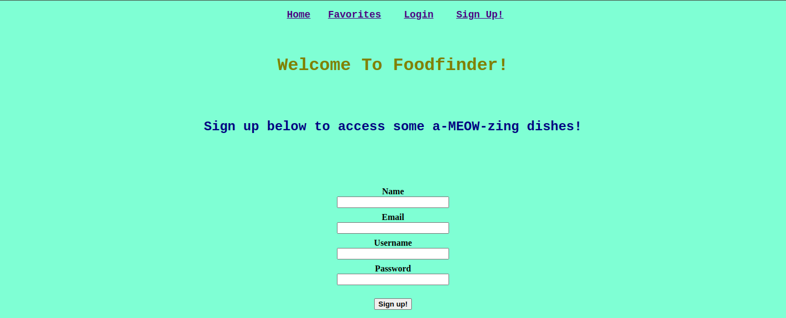
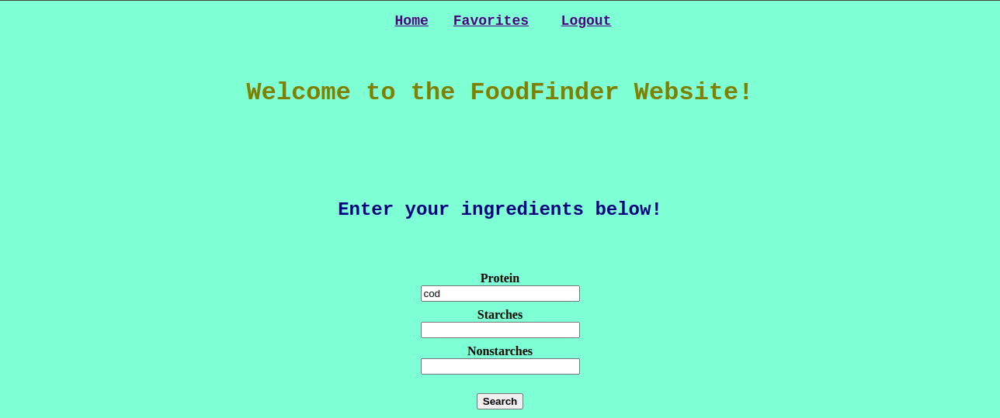
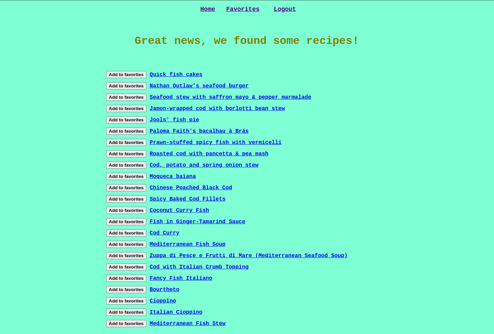
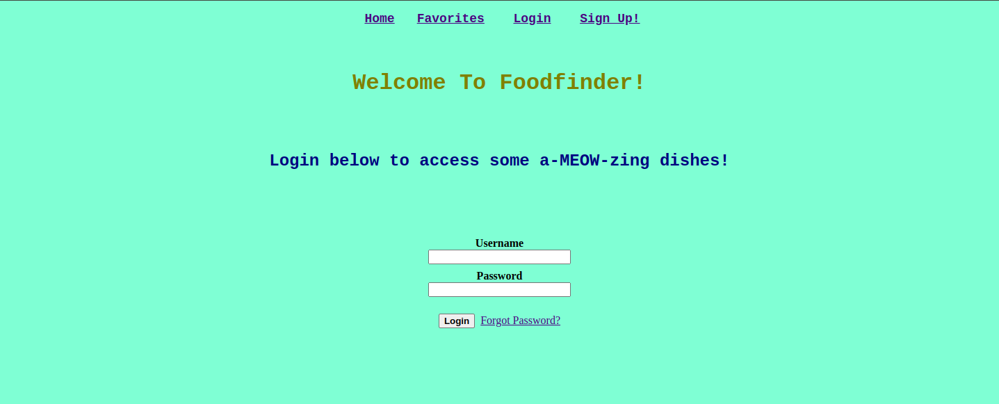

# FoodFinder: Your one-stop shop for a-MEOW-zing recipes!

FoodFinder is a website where you can easily search for recipes based on ingredients, and save
the recipes to make again and again!

On the sign up page, you can register for an account so you can save all your favorite recipes for later reference.

_FoodFinder Signup Page_

After registering for an account, you can log in to search for recipes containing specific ingredients.

_FoodFinder Home Page_

_FoodFinder Search Results_

Finally, after finding recipes you like, you can add them to your favorites to come back to later.

_FoodFinder Favorites_

## Technologies Used
Flask, Python, SQLlite3, CSS/HTML

## Getting Started

To get the project running, follow the steps below:

1. Create or navigate to your Python environment
1. Clone this repo: 'git clone https://github.com/cab455/food-finder.git'
2. Install project dependencies: 'pip install -r requirements.txt'
3. Acitvate virtual environment and set development environment variables:  
    'export FLASK_APP=foodfinder'     
    'export FLASK_DEBUG=True'
4. Run the project: 'flask run'
5. Open a browser and visit 'http://localhost:5000'

## Sign up, login, and save to favorites

_FoodFinder Login Page_

After navigating to the sign up page, you can create a new account. Once logged in, search for 
recipes on the home page and save them to your favorites. 
If you do not want to create a new account, you can use my test login credentials below to check out the website.

Username: johndoe456    
password: holamundo